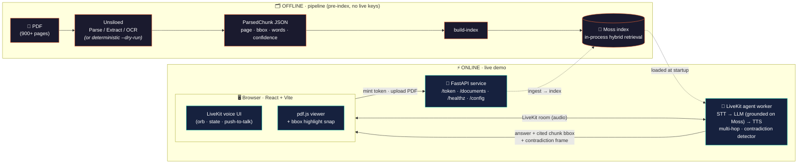
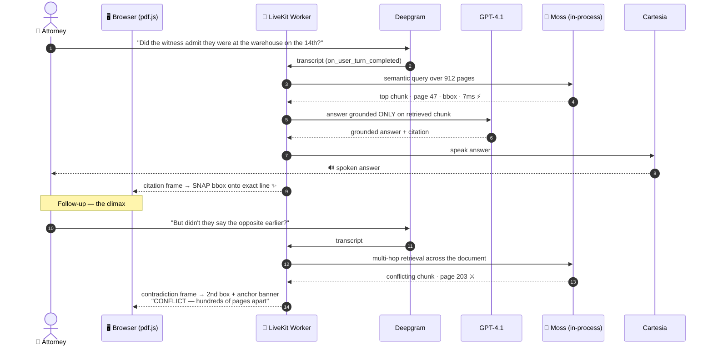

<div align="center">

# ⚖️ CrossExam

### Cross-examine documents by voice. It answers, points to the exact line, and catches contradictions pages apart.

*Ask 900 pages a question out loud — and watch the answer land on the exact line, in `<10ms`.*

<br/>

[](https://events.ycombinator.com/conversational-ai-hackathon-2026)
[](docs/co-pilot-positioning.md)
[](crossexam/STATUS.md)

*Hosted by **Moss (F25)** at Y Combinator, San Francisco · June 6–7, 2026*

<br/>

**Sponsor stack**

[](https://events.ycombinator.com/conversational-ai-hackathon-2026)
[](https://livekit.io)
[-PDF%20bounding%20boxes-4B8BBE?style=flat-square)](https://unsiloed-ai.com)

**Voice pipeline**

[](https://deepgram.com)
[](https://openai.com)
[](https://cartesia.ai)
[](https://www.minimax.io)
[](https://aws.amazon.com)

**Stack**

[](https://python.org)
[](https://fastapi.tiangolo.com)
[](https://react.dev)
[](https://typescriptlang.org)
[](https://vitejs.dev)
[](https://mozilla.github.io/pdf.js/)
[](crossexam/docker-compose.yml)

</div>

---

## 🎯 What it is

**CrossExam is a real-time voice co-pilot that proves every answer on the page — live.** You interrogate a document out loud; it answers by voice and **snaps a verifiable highlight box onto the exact cited line** the instant the claim is spoken. The question, the spoken answer, and the source line all land on screen in the same moment.

It is **not a notetaker.** It doesn't summarize after the call — it proves the answer *during* the call. And its hero move is the one a litigator lives for: **catching a contradiction.** Ask a follow-up and CrossExam surfaces a *second* box — on a page hundreds apart, or in an entirely different document — exposing the conflict (a contract that says *"Net-30"* against an email admitting *"Net-60"*) with an anchor banner naming the discrepancy. That is cross-examination, automated.

| | |
|---|---|
| 🔎 **Moss** | Sub-10ms **in-process** semantic retrieval — finds the one relevant line out of 900+ pages with no network round-trip to a bolt-on vector DB. |
| 📦 **Unsiloed** | Offline pipeline turns PDFs into **citation-grade chunks** — page + word-level bounding box + confidence — so the highlight is verifiable, not approximate. |
| 🎙️ **LiveKit** | The real-time voice loop: STT → LLM grounded on Moss → TTS, with turn detection and barge-in. |
| ⚔️ **Cross-exam engine** | Multi-hop, multi-document retrieval that **flags conflicting citations** across pages and across files. |

> 💡 The whole stack runs end-to-end in **mock mode with zero API keys**, so you can demo it offline on a plane.

---

## 🧠 Why it wins

Voice agents "fall apart on domain-specific info." Ungrounded LLM bots hallucinate citations **15–27%** of the time; grounded retrieval drops that to **0.7–1.5%**. In 2026, fabricated citations have already produced **$145K+ in court sanctions**. The deeper problem isn't *search* — it's **trust**: you can't act on an answer you can't see on the page, and a 3-second pause to find a clause mid-deposition is the difference between catching a witness and losing the room.

Every incumbent surfaces value at the **wrong time** or surfaces something **unverifiable**:

| Tool | What it does | The gap |
|---|---|---|
| Granola / Otter / Fireflies | Summarize **after** the call | Value lands in your inbox, not the room. No live source line. |
| Gong / Clari | Generic battlecards + analytics | Coaching cues, not a verifiable line from *this* document. |
| Cresta | Scripted next-best-action | Prompts, not a grounded citation snapped to a source. |
| Abridge / Nuance DAX | Write the note | Generation, not live verifiable retrieval against a source. |

**None of them visibly snap a verifiable source line in real time — or expose a contradiction across documents as it's spoken.** That whitespace is CrossExam's wedge: **verifiable co-presence.**

---

## 🏗️ Architecture



### The 90-second kill shot — sequence



---

## ✨ Features

- 🎙️ **Live voice interrogation** — full STT → grounded-LLM → TTS loop on LiveKit Agents, with multilingual turn detection and barge-in.
- ✨ **The bounding-box snap** — the hero moment. A glowing box draws onto the **exact line** of the rendered PDF the instant the claim is spoken, with an auto page-jump and a `found in 912 pages · 7ms` latency chip.
- ⚔️ **Contradiction / cross-examination** — multi-hop, multi-document retrieval that flags conflicting citations across distant pages or across two files (contract ↔ email), with a plain-English **anchor banner** (`CONFLICT — Anchor: §4.2 Subcontracting`).
- 📑 **Citation-grade chunks** — Unsiloed gives word-level bounding boxes + confidence, so highlights are provable, not fuzzy.
- 📋 **Export to legal memo** — deterministic `buildMemo(session)` assembles cited passages and detected contradictions into an IRAC memo (verbatim quotes, never paraphrased).
- 🛡️ **Grounded-only answering** — a faithfulness threshold keeps the LLM speaking only from retrieved text; ungrounded answers are suppressed.
- 🔌 **Zero-key mock mode** — backend, pipeline, and frontend all fall back to deterministic fixtures, so the entire app demos offline.

---

## 🧩 Tech stack

| Layer | Path | Stack |
|---|---|---|
| **Backend** | `crossexam/backend/` | Python · LiveKit Agents 1.x · FastAPI · Deepgram (Nova-3) · OpenAI (GPT-4.1) · Cartesia (Sonic-3) · Silero VAD |
| **Retrieval** | in-process | **Moss** (`inferedge-moss`) — sub-10ms hybrid retrieval SDK, *not* a REST API |
| **Pipeline** | `crossexam/pipeline/` | Python · **Unsiloed** Parse/Extract/OCR · pdfplumber · deterministic dry-run parser |
| **Frontend** | `crossexam/frontend/` | React 18 · TypeScript 5.7 · Vite 5 · pdf.js 4.7 · `@livekit/components-react` · framer-motion |
| **Infra** | repo root | Docker Compose · GitHub Actions CI (mock + real-SDK jobs) · Makefile |

---

## 🚀 Quickstart

Requires **Python 3.10+** and **Node.js 20+**.

```bash
# One command from the repo root — starts API + voice worker + frontend,
# streams colored logs, and prints live-vs-mock once the API answers.
./run.sh
```

Then open **http://localhost:5173** and either drop a PDF or click **Run demo**.

<details>
<summary><b>Or run it the granular way (from <code>crossexam/</code>)</b></summary>

```bash
make setup       # install backend + pipeline (editable) and the frontend
make index       # build the (mock) index from the bundled sample deposition
make dev         # backend worker + frontend dev server (mock mode)
make dev-live    # HTTP API + worker + frontend (token + upload + live voice)
make test        # pytest (backend + pipeline) + vitest (frontend)
make verify-live # doctor READY/MISSING/MOCK table + probe /healthz & /config
```

</details>

<details>
<summary><b>Going live with real keys</b></summary>

CrossExam is **live-by-default**: it detects keys in `crossexam/.env` and connects to real services, falling back to mock otherwise. Copy `crossexam/.env.example` → `crossexam/.env`, fill in Moss / LiveKit / voice keys, then:

```bash
cd crossexam
make install-moss                            # install the [moss] extra (in-process SDK)
python -m livekit.agents download-files      # one-time: turn-detector + Silero VAD weights
make verify-live                             # runs a REAL Moss load_index probe
# pre-build the index offline from your PDFs:
cd pipeline && python -m crossexam_pipeline.cli build-index \
    --input build/chunks.json --index-name "$MOSS_INDEX_NAME" && cd ..
../run.sh
```

The retrieval path is the **in-process Moss SDK** (`inferedge-moss`) — there is no `MOSS_BASE_URL`. Full key list and step-by-step in **[`crossexam/KEYS.md`](crossexam/KEYS.md)**.

</details>

<details>
<summary><b>Docker</b></summary>

```bash
cd crossexam && docker compose up --build   # backend worker + frontend on :5173
```

`docker-compose.yml` treats `.env` as optional, so the stack still comes up in mock mode with no secrets.

</details>

---

## 🎬 The demo storyboard

| Time | On screen | The shot |
|---|---|---|
| 0–10s | Split: LiveKit orb · PDF scrolling **"p.1 of 912"** | Establish the haystack |
| 10–25s | Orb `LISTENING` — *"Did the witness admit they were at the warehouse on the 14th?"* | State badge flips |
| 25–40s | Orb `THINKING`; right pane blurs through 900 pages | The Moss-is-working shot |
| **40–60s** | **THE SNAP** — glowing box draws onto the exact line; caption streams the answer; chip reads **`found in 912 pages · 7ms`** | 🏆 The winning screenshot |
| 60–78s | Follow-up surfaces a **second box on p.203** → *"it found a contradiction hundreds of pages apart"* | ⚔️ The climax |
| 78–90s | Freeze on dual citations — *"Verifiable co-presence: every claim provable the moment it's made."* | Deck cover frame |

---

## 📂 Repository layout

```
moss-hackathon/
├── README.md                  ← you are here
├── run.sh                     ← one-command launcher (API + worker + frontend)
├── crossexam/                 ← the application
│   ├── backend/               ← LiveKit voice-agent worker + Moss retrieval + FastAPI
│   ├── pipeline/              ← offline PDF → Unsiloed → indexable chunks
│   ├── frontend/              ← React voice UI + pdf.js bbox-snap viewer
│   ├── docker-compose.yml · Makefile · KEYS.md · STATUS.md
│   └── .env.example           ← every env var, documented
├── .claude/agents/            ← the 6-agent debate team that chose this idea
└── docs/
    ├── pitch-crossexam.md         ← the Problem→Team pitch
    ├── co-pilot-positioning.md    ← competitive whitespace
    ├── v3-features-spec.md        ← memo export + multi-doc cross-examination
    ├── demo-storyboard.md         ← the 90-second shot list
    ├── build-plan.md              ← 24h critical path + risks
    └── debate-transcript.md       ← the full multi-agent debate
```

---

## 🏆 The hackathon

**[Conversational AI Hackathon](https://events.ycombinator.com/conversational-ai-hackathon-2026)** — hosted by **Moss (F25)** at **Y Combinator, San Francisco**, **June 6–7, 2026**.

> *"Voice models are now cheap and fast to the point where they are no longer the bottleneck — retrieval is. Now with Moss, the infrastructure for real-time semantic search has fully matured."* — event brief

| | |
|---|---|
| **Host** | Moss (F25) |
| **Sponsors** | LiveKit · TrueFoundry · Unsiloed (F25) · AWS · MiniMax · Qwen |
| **Tracks** | Lead Gen · Support · **Co-Pilot** *(ambient agents that listen in and display live context)* |
| **Prizes** | 🥇 YC interview + iPhones + sponsor credits · 🥈 AirPods Max · 🥉 AirPods Pro |

**CrossExam competes in the Co-Pilot track** — its whole design *is* the track definition: an ambient agent that listens to a live conversation and displays the live, verifiable context (the cited line) the instant a claim is spoken. It leans on **Moss** (the host's retrieval core), **LiveKit** (real-time voice), and **Unsiloed** (citation-grade PDF bounding boxes), with **MiniMax** and **AWS** wired as optional providers.

---

## 🤖 How the idea was chosen

CrossExam was selected by a **Claude Code multi-agent debate team** (`.claude/agents/`) — an Ideator, a relentless **Devil's Advocate**, a Researcher, a Demo-Designer, and a BizDev pitch lead, conducted by an Orchestrator-Judge simulating four hackathon-judge archetypes. It beat 7 other candidates on the Devil's Advocate's decisive reframe:

> *"If the differentiator can't be photographed, it can't win."*

CrossExam is the only idea where Moss's sub-10ms edge is **visible and photographable** on stage — the box snapping onto the line, and the second box exposing the contradiction. Full transcript in [`docs/debate-transcript.md`](docs/debate-transcript.md).

---

<div align="center">

**⚖️ CrossExam — Ask the document. It points to the proof.**

*Built for the Conversational AI Hackathon · hosted by Moss (F25) at Y Combinator, San Francisco · June 6–7, 2026*

</div>
